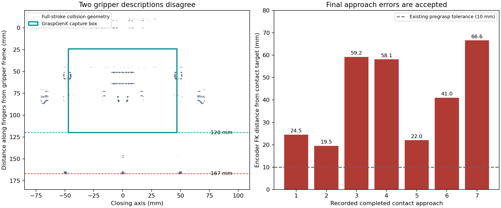

# OpenYAM GraspGenX workflow audit — 24 September 2026

The current workflow has concrete model and execution inconsistencies. Camera resolution and a shifted camera extrinsic are not the leading explanation. The strongest findings are disagreement between the gripper capture model and collision fingertips, contact trajectories without environment collision checking, and large contact-position errors that do not prevent closing or reporting success. Grasp generation and filtering also need changes.

This audit inspected the current repository, adjacent DimOS implementation, installed GraspGenX revision and model configuration, and the running blueprint's recorded attempts. It read live RGB-D frames, camera metadata, the robot-state tool, and two stationary apple scans. It did not command arm/gripper motion, restart the blueprint, change calibration/configuration/runtime code, install dependencies, or run tests. Existing working-tree modifications predate this audit. Only this report, its figure, and ignored diagnostic artifacts were added.

The measured workspace definition is taken as given. Physical standard-gripper dimensions were not remeasured; the gripper finding below is an internal inconsistency between the configured representations, independent of that assumption.

## 1. Highest priority: the two gripper descriptions disagree

The profile's GraspGenX capture volume has Z center **71.999 mm**, length **96.002 mm**, and therefore spans **24–120 mm** from the generated grasp frame. Its `fingertip_depth` is **120 mm**. The transform to the URDF TCP rotates the axes and translates by **120 mm**. The URDF places `gripper_tip` **120 mm along gripper −Z**.

Those transforms make the generated grasp-frame origin coincide with the URDF `gripper` origin, with a rotation. However, the actual configured collision meshes reach approximately **166.8 mm along gripper −Z**. Their fingertips therefore extend **46.8 mm past the TCP/capture-box endpoint** assumed by the grasp configuration. A TCP may intentionally be inside a gripper, but then the generated-frame transform and capture volume must describe that choice consistently. Here the named fingertip depth and the corresponding collision geometry disagree.

The manifest explicitly describes an additional **20 mm distal extension** to the main finger sweeps. Before that extension, the manufacturer visual fingertips reach approximately 146.8 mm; the current 120 mm TCP is not simply the end of the original manufacturer fingers either. Increasing both a preexisting 100 mm TCP and its grasp depth by 20 mm did not reconcile the original offset discrepancy.

Using the current collision vertices, their URDF origins, and the actual logged TCP poses, the first attempted target puts some gripper geometry at **world Z≈−50.7 mm** over the bench footprint. The configured bench top is **−20 mm**. Another selected target reaches **−73.0 mm**. These are modelled penetrations of roughly **31 mm and 53 mm**, respectively. This calculation needs no arm IK: a TCP pose fixes the entire rigid gripper pose.

**Implication:** even accepting the collision model as correct, the grasp conditioning/TCP relationship is not consistent with it. A high-scoring grasp can be physically too deep. This can cause a finger to hit the object or table before the commanded TCP arrives. The conservative full-stroke collision hull is not an exact contact surface, so these numbers establish a model conflict rather than proving the exact physical contact point.

**Change to make:** derive the capture volume, fingertip reference, and generated-frame-to-TCP transform together from the standard gripper's contact geometry, using one documented frame convention. Reconcile the documented 20 mm extension with the standard fingers. Do not compensate by shifting the camera or adding an arbitrary world-Z correction.

Evidence: [profile](../workspace-config/openyam_bench.json), [URDF](../workspace-config/yam_collision.urdf), [manifest](../workspace-config/yam_collision.manifest.json), [calculated geometry](../workspace-config/temp/grasp-audit-20260924/gripper-geometry.json).

## 2. Contact execution accepts large errors and bypasses collision checks

The current run is `20260924-183111-openyam-coordinator-agentic-openyam-grasp-graspgenx-agent`. Its seven pick-tool calls at approximately 18:32–18:36 local time returned three `Pick complete`, one empty-grasp failure after retries, two pregrasp tracking failures, and one planning failure. These are software outcomes, not independently verified physical successes.

Seven completed contact approaches have encoder-derived TCP position errors of approximately **24.5, 19.5, 59.2, 58.1, 22.0, 41.0, and 66.6 mm**. Their Z errors are all positive: the TCP remains above the requested contact target. An additional failed Cartesian plan leaves a 106 mm discrepancy and is excluded from those seven. Some much larger pregrasp discrepancies in the log also correspond to planning failures without motion; they must not be counted as tracking errors.

For comparison, the first three completed pregrasp moves have errors of **1.8, 2.0, and 3.6 mm**. The discrepancy appears principally during the contact leg. Even two calls reported as successful have contact errors of about **41 and 67 mm**.

The code explains why this is accepted:

- `_move()` checks pregrasp position against a 10 mm tolerance.
- `_servo()` waits 0.5 s and logs the reached pose, but imposes no contact position or orientation tolerance.
- The inherited `_servo()` calls `move_linear(..., check_collision=False)`. This disables collision validation for the whole final leg, including the bench and robot geometry; the correct static collision model cannot prevent those contacts.
- The trajectory task declares completion when the final **commanded** joint positions have been emitted, without requiring the encoders to reach them.
- The Cartesian command preserves measured orientation. It does not correct pregrasp orientation error to the generated orientation.

The logs do not include final planned-joint FK plus a time series of joint error/effort. Consequently they cannot uniquely distinguish physical obstruction, controller tracking/holding error, and a Cartesian planning endpoint error. The modelled table penetration makes obstruction a substantial suspect. Raising gains would be premature.

**Change to make:** require final planned FK to match the requested pose, then require fresh encoder position/orientation convergence before closing. Keep environment/self-collision validation during approach; allow only the intended gripper/object contact. Record the final commanded and measured joint poses, contact error and gripper readback. Select reachability using the full approach, not just its elevated starting pose.

Evidence: [local pick implementation](../src/openyam_coordinator_agentic/grasp.py), [inherited pick implementation](../../dimos/dimos/manipulation/pick_and_place_module.py), [Cartesian command](../../dimos/dimos/manipulation/manipulation_module.py), [trajectory completion](../../dimos/dimos/control/tasks/trajectory_task/trajectory_task.py), [preserved run records](../workspace-config/temp/grasp-audit-20260924/run-evidence.json).

## 3. Approach preference and motion do not match

The active orientation gate accepts **0–45°** from top-down and **60–90°**, rejecting the useful **45–60°** above/side range. Side scores are multiplied by 0.5. A 44° grasp has no tilt penalty relative to a vertical grasp; a 46° grasp is discarded; a 60° grasp is allowed again. Orientation rejections are not counted in the report, making its diagnostics incomplete.

The sign convention is internally correct: OpenYAM approaches along TCP **−Z**, so `acos(R_tcp[2,2])` measures tilt from top-down. **True upward approaches (>90°) are already rejected** by the current filter. All 33 logged candidate targets in the examined run are top-class grasps, below 45°. The observed impression of coming from below could concern earlier versions, motion from the folded starting pose, or fingers positioned below the object's center. The logs do not establish which observation the user saw. The approach preference does not constrain the preceding joint-space path.

Separately, `_offset_pose()` always adds **100 mm in world +Z**. The contact leg therefore descends vertically even when the gripper is tilted or horizontal. A learned grasp assumes insertion along its approach axis; descending sideways fingers through the object can push or roll an apple. The lateral displacement of a correctly constructed axial pregrasp is intentional. At 45°, a 100 mm axial standoff is approximately 71 mm sideways and 71 mm above the contact pose.

**Change to make:** allow a continuous **0–60° cone**, smoothly favor near-vertical approaches, and reject horizontal/below grasps for this workspace preference. Construct the insertion pregrasp as `p_contact + distance * R_tcp[:, 2]`, then insert along TCP −Z. Use a separate elevated transit waypoint if needed; separately lift the object vertically after acquisition. Apply robot/table clearance checks throughout. The 60° limit is a proposed preference, not a measured optimum.

Evidence: [quality filter](../src/openyam_coordinator_agentic/grasp_quality.py), [offset and pick flow](../src/openyam_coordinator_agentic/grasp.py).

## 4. GraspGenX configuration: valid model loading, incomplete deployment policy

The adapter uses GraspGenX source revision `b9429097728cb1c430dd78b92edf17ba318aad03` and model revision `7c834043c11a11417e31d6d5ea9355801e40a2c1`. The merged generator and discriminator both use `sweep_volume_v2`; generator diffusion evaluation uses **20 steps**. The model loader correctly combines the generator's diffusion block with the discriminator configuration. `parallel_2f` is appropriate for the standard linear gripper, and the approximately 94 mm opening is consistent in scale with the manufacturer's approximately 95 mm stroke.

However, the runtime calls inference with defaults:

| Setting | Effective behavior |
|---|---|
| Planner | Diffusion proposals only; no GraspMoE/OBB branch |
| Generated proposals | 200 |
| Raw score threshold | −1, meaning no useful confidence floor |
| Returned proposals | Top 100 **before** local orientation/geometric gates |
| Internal minimum | 40 proposals, up to six inference iterations; normally satisfied immediately by unthresholded results |
| Extra outlier removal | Enabled: 20-neighbor mean L1 distance below 14 mm |
| Object RGB / scene / support plane | Not supplied to inference |
| Local cap | 100 retained; pick checks up to 20 candidates for planning, with at most three physical attempts across rescans |

Changing `max_candidates` above 100 alone cannot increase the generator's default returned pool. There is no minimum raw score in the local gate either. Upstream's current scene examples expose thresholds and retain the generated pool for downstream selection; a **0.7 raw-score floor** is a reasonable initial comparison setting, not a universal calibrated probability of physical success. In these logs the best raw scores are already mostly 0.8–0.95, so a threshold alone would not fix the observed misses.

**Change to make:** expose proposal count, confidence floor, returned-pool size and outlier policy in this repository's adapter/config. Filter orientation, contact support, collision and approach reachability before the final top-K; retain orientation/position diversity. A comparison of 200 versus 400–800 proposals may help when feasible top approaches are scarce, but geometry and execution should be corrected first. GraspMoE with above/side proposals is an optional later comparison, not required to address the confirmed defects.

Evidence: [DimOS adapter](../../dimos/dimos/manipulation/grasping/grasp_gen_x/module.py), [runtime](../../dimos/native/python/graspgenx/graspgenx_runtime/backend.py), [upstream usage](https://github.com/NVlabs/GraspGenX/blob/main/client-server/README.md), [manufacturer stroke](https://i2rt.com/products/yam-gripper-1). Current upstream examples are not evidence that those features are enabled in this pinned runtime.

## 5. Quality gating counts points, but does not establish a stable grasp

The filter requires 150 object points, 24 occupied 3 mm voxels, 50 points inside the open capture box, at least 6 mm closing span, and limits capture-point mean offset. It measures span **after clipping points to the opening**. An object too wide for the jaws can therefore contribute an apparently acceptable interior subset.

It does not establish bilateral opposing contact, surface-normal compatibility, capture of the object's bulk, finger/palm clearance, support-plane clearance, or collision-free insertion. A patch on one visible surface can pass. Its support score saturates at 150 captured points; logged best candidates typically capture hundreds of points, so this term supplies little discrimination. Across ten scans / 1,000 input proposals, only **two rejections** were reported for these geometric tests; other removals were predominantly the unreported orientation gate. No minimum quality score is imposed after rescoring.

**Change to make:** validate opposing contact support and object fit using geometry beyond the already-clipped box, reject contact with the support surface, check actual finger/palm geometry, and report every rejection reason. Single-view density cannot certify the hidden side of an apple.

## 6. Perception: sufficient resolution, but a mask-coordinate bug and depth bias

Live capture confirms a **RealSense D435i**, **1280×720 RGB and aligned depth**, approximately **6 FPS**, matching color/depth optical frame IDs and intrinsics, and depth units of **0.001 m**. The sampled pair differs by about **0.56 ms**. Approximately **98.75%** of full-frame depth pixels are nonzero; the inspected apple interior has valid depth throughout. With focal length about 909 pixels and distances around 0.5–0.6 m, nominal image sampling is approximately 0.55–0.66 mm/pixel. This is not a statement of depth accuracy.

Object extraction uses **2 mm voxels**, **one pixel erosion**, and statistical outlier removal with **12 neighbors / 0.75 standard deviations**. Recorded apple inputs contain **1,361–1,630 points**. Increasing camera resolution is not the first intervention. `enable_pointcloud=False` disables only the camera's optional separate cloud publisher; object clouds are built from the full aligned depth image. Its separate `pointcloud_decimation=2` therefore does not decimate grasp clouds.

The detector is **YOLOE-11l-seg**, confidence **0.6**, IoU **0.6**. No second segmenter runs with the YOLOE backend. The call does not explicitly set inference image size or `retina_masks`; installed Ultralytics defaults use image size 640 and non-native masks. DimOS's `Detection2DSeg.from_ultralytics_result()` directly resizes the padded model mask to the original image, without removing letterbox padding. For a usual 640×384 padded inference on this 1280×720 image, this compresses mask Y about the image center and can shift boundaries by up to approximately **22.5 original pixels**. The exact live predictor tensor shape was not captured, so that magnitude is conditional; the missing inverse-letterbox operation is present in the code. This is a plausible source of table pixels and incomplete apple geometry, especially away from image center.

**Change to make:** use masks mapped correctly to the original image (`retina_masks=True` or proper inverse letterboxing), and expose detector inference resolution explicitly. Inspect the corrected mask and cloud before changing erosion/outlier thresholds. Avoid treating duplicated/interpolated pixels as new geometric information. Multi-frame or multiview fusion could help coverage later, provided moved objects do not retain old geometry.

Evidence: [live capture](../workspace-config/temp/grasp-audit-20260924/capture.json), [scene](../workspace-config/temp/grasp-audit-20260924/scene.jpg), [dense extraction](../src/openyam_coordinator_agentic/dense_scene_registration.py), [mask conversion](../../dimos/dimos/perception/detection/type/detection2d/seg.py), [detector](../../dimos/dimos/perception/detection/detectors/yoloe.py).

## 7. Calibration, feedback, retries and reporting

The current saved camera transform predicts the live AprilTag center within approximately **(+0.20, +0.10, −0.22) mm**, and tag orientation within **0.13°**, with **0.077 pixel** reprojection RMS. This is a consistency observation using the same tag/reference, not an independent proof of absolute arm/TCP accuracy. It argues against camera movement as the main cause of the recorded centimetre-scale misses.

Depth is less consistent: manually selected bare-table patches have median world Z approximately **−14.4, −15.9, and −8.2 mm**, versus the configured **−20 mm** surface. This is a **4–12 mm depth-to-plane discrepancy**. Its source could be spatial depth bias, RGB/depth geometry, or physical surface deviation; this audit does not identify it uniquely. Treat it as a separate depth measurement issue rather than moving the RGB camera extrinsic to absorb it. The wrist camera does not participate in this blueprint's grasp localization or verification, so its saved calibration cannot currently improve grasp placement.

Other workflow findings:

- Fresh observations replace each matched object's point cloud, which correctly avoids accumulation after motion. The published aggregate still contains permanent historical objects: the live aggregate had 7,466 points and an old timestamp while the scan returned one apple. This is not evidence that `pick_object` receives that aggregate; it requests one object ID. It can confuse visualization or later obstacle consumers.
- Initial picks lack an explicit maximum cloud age. Retry waits of 0.5 s make new frames likely at 6 FPS but do not prove freshness if a stream stalls. Reject stale timestamps explicitly.
- Retrying after a close failure clears the camera view, rescans and regenerates, which is useful. It does not remember failed pose families, so a similar failure can repeat. Retry selection uses the first matching label rather than a robust association if multiple apples exist.
- The failed-grasp retreat uses the original requested relative leg, rather than correcting from the measured reached position as the normal `_servo()` does.
- The local pick override omits the base class's guard against picking while already holding an object. It clears selection before opening the gripper. Restore that state guard.
- Closing verifies only that normalized jaw position settles between **0.10 and 0.95**. The recorded empty reading **0.012** is clearly in the empty band; that threshold is not the leading cause of those empty failures. A stalled jaw can also indicate table/object-edge contact, and there is no post-lift visual or sustained-hold verification.
- Hardware uses `default_current=0.15` for the gripper. The current was not varied and grip force was not measured; low force/slip remains possible, but does not explain a contact pose never being reached. The zero gripper entry in arm PD gains does not by itself imply zero gripping force: gripper commands use a separate hardware path.
- `place_at` inherits the same vertical offset/contact policy and does not attach a held-object collision model. Its release coordinate is explicit, which is appropriate, but the same trajectory/verification weaknesses extend to placing.
- The read-only robot-state request during this audit returned no current arm joints/TCP, although it returned a gripper position. Thus current encoder availability was not sufficient for a new hardware tracking diagnosis. Historical encoder observations above come from the recorded attempts, not current motion.

Evidence: [camera geometry observation](../workspace-config/temp/grasp-audit-20260924/camera-geometry.json), [robot state](../workspace-config/temp/grasp-audit-20260924/robot-state.json), [verification](../../dimos/dimos/manipulation/grasp_verification.py), [hardware adapter](../../dimos/dimos/hardware/whole_body/openyam_damiao/adapter.py).

## Recommended order

1. Reconcile standard-gripper geometry, capture volume and TCP reference; reject table-intersecting targets and approaches.
2. Make contact endpoint/encoder convergence a condition for closing, and distinguish successful commands from a physically verified lift.
3. Use a continuous top/above-side cone and insert along the chosen gripper axis.
4. Correct segmentation-mask coordinates and quantify the remaining depth-to-plane discrepancy.
5. Strengthen contact support and diversity filtering, then compare confidence/sample-count settings.

This ordering addresses observed contradictions before tuning inference sampling. No change in physical success rate is claimed: the audit performed no new grasp trials.

## Implementation follow-up

The repository now contains the configurable GraspGenX runtime adapter, native
YOLOE masks, contact/scene/direction/diversity filtering, absolute collision-checked
Cartesian motion, endpoint and encoder convergence gates, fresh retry association,
failed-pose exclusion, and post-lift jaw verification. Effective values and runtime
limitations are documented in [workspace settings](../workspace-config/README.md#grasp-settings-and-execution).

For the geometry discrepancy, the existing collision model (including the prior
20 mm distal extension) is retained as the reference. The capture band and named
fingertip depth now end at its distal extent. The TCP remains at 120 mm inside
the envelope; its transform still maps the generated body frame consistently.
This avoids redefining the wrist-camera calibration's tool frame. Opening width,
pad thickness and contact-band length retain their configured values. This is
a correction of the model/configuration relationship, not a new measurement of
the physical fingers or proof that the extension matches them.

Camera/arm/tag calibration, gains and gripper force were not retuned. Depth-bias
measurement, physical geometry confirmation, visual lift confirmation, held-object
collision modelling and a sample-count/confidence success-rate comparison remain
measurement or follow-up work. No tests, runtime startup, or hardware trials were
performed for the implementation; loading it requires a blueprint restart.

### Subsequent runtime observations

In run `20260924-225809-openyam-coordinator-agentic-openyam-grasp-graspgenx-agent`,
three user-triggered insertions took 9.346, 47.652 and 19.785 seconds for an
approximately 100 mm approach. Planned endpoints were within 0.11 mm, while
encoder-derived final errors were 23.2, 12.7 and 9.8 mm. All three returned
`EXECUTION_FAILED` before the close command because of the 5 mm convergence gate.
These were therefore failed approaches, with no attempted jaw acquisition.

The local adapter had explicitly disabled TOPP-RA corner blending. The installed
RoboPlan 0.6.0 source shows that its resolved joint-path corners slow the trajectory
and that bounded mode applies a global slowdown for Cartesian peak limits.
The profile now allows 0.005 rad blending, limits approach speed/acceleration to
0.08 m/s and 0.3 m/s², and rejects approaches exceeding 8 seconds. Actual durations
are logged so the effect can be assessed on subsequent attempts.

Closure now requires the measured, settled pose to pass the full single-pose
contact/clearance filter, with a maximum 15 mm / 3° miss from the requested pose.
This can accept a supported grasp at a slightly different attained pose; it does
not correct the underlying tracking error. The 23.2 mm example remains outside
the allowed range. Joint feedback and explicit close/readback logs were added
to support further diagnosis. No new pick was commanded by this repair.
